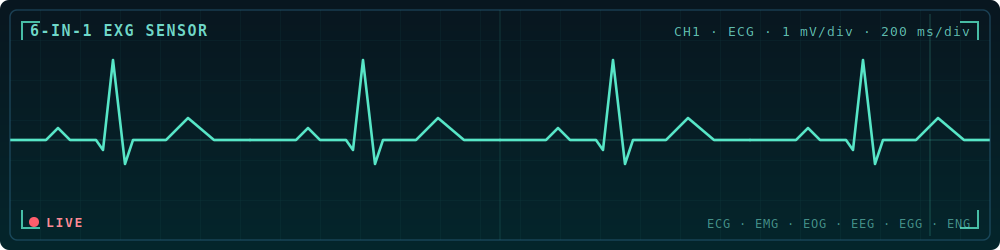
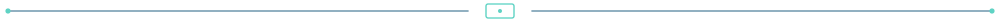
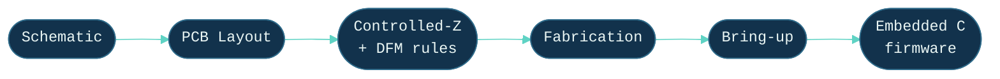

<div align="center">


<br/>

[](https://git.io/typing-svg)


[](https://linkedin.com/in/rohit-nalbuga)
[](mailto:rohitnalbuga2@gmail.com)


<br/><br/>



</div>



## 🚀 About Me

```c
board_t rohit = {
    .role      = "PCB & Embedded Systems Designer",
    .degree    = "B.Tech ExTC, expected 2027",
    .does      = "schematic -> layout -> firmware, one hand off",
    .domains   = { "RF", "biomedical", "robotics" },
    .learning  = "antenna & RF/microwave design",
};
```

- 🔩 I take PCBs from **schematic to fabrication-ready in Altium** — 2-to-6-layer, controlled-impedance boards — and write the **Embedded C** firmware that runs on them
- 🏆 My boards have been recognized at **IIT (BHU) Varanasi Technex 2026** and **IIT Bombay Techfest 2026**
- 🔭 Currently building a **behind-ear biosensing wearable** and a **6-in-1 biopotential sensor**
- 💬 Ask me about **PCB stackups, controlled impedance, or biopotential front-ends**

## ⚡ By the Numbers

<div align="center">

| 🔩 **5** | 📐 **6-layer** | ⚡ **6-in-1** | 🎯 **50 Ω / 90 Ω** | 🏅 **IIT BHU** |
|:--:|:--:|:--:|:--:|:--:|
| custom boards designed | deepest stackup | biopotential sensor | controlled impedance | Technex 2026 recognition |

</div>

## ⚙️ From Schematic to Bring-Up

> I own the whole chain — the board *and* the firmware on it.



## 🛠️ Tech Arsenal

| Domain | Stack |
|:--|:--|
| **PCB & EDA** |   |
| **MCUs & Silicon** |        |
| **Firmware** |    |
| **Signal & RF** |   |


## 🔬 Projects

> ⚠️ Most design files are private (in development / client work). Happy to walk through any on request.

<table>
<tr>
<td width="50%" valign="top">

**◆ Chordy** — controlled-impedance ESP32-S3 board<br/>
<sub>*4-layer · Altium · 50 Ω CPWG / 90 Ω USB, DFM to fab spec*</sub>

</td>
<td width="50%" valign="top">

**◆ VELA** — behind-ear sleep-tracking wearable<br/>
<sub>*nRF5340 · 6-layer puck + 4-layer case · optical PPG + bio-impedance*</sub>

</td>
</tr>
<tr>
<td width="50%" valign="top">

**◆ 6-in-1 EXG** — biopotential sensor<br/>
<sub>*TI TL074 · 2-layer · one front-end → ECG/EMG/EOG/EEG/EGG/ENG*</sub>

</td>
<td width="50%" valign="top">

**◆ VEERA** — multi-sensor IoT & robotics board<br/>
<sub>*ESP32 + Arduino UNO · 2-layer · dual motor drivers · 15+ peripherals*</sub>

</td>
</tr>
<tr>
<td width="50%" valign="top">

**◆ KARA_V1** — dual-MCU development board<br/>
<sub>*STM32 + ESP · 4-layer · Altium*</sub>

</td>
<td width="50%" valign="top">

**◆ AERIS** — air-quality monitor<br/>
<sub>*ESP32 · MQ sensors, calibration + filtering · Technex 2026 (IIT BHU) recognition*</sub>

</td>
</tr>
<tr>
<td width="50%" valign="top">

**◆ High-Speed Line Follower** — PID robot<br/>
<sub>*sensor-array line tracking · Technoxian World Cup*</sub>

</td>
<td width="50%" valign="top">

**◆ Internship builds** — Karmic Nexus<br/>
<sub>*PIC18F47K42 dev board · VC02 smart-farming · EV↔petrol switching circuit*</sub>

</td>
</tr>
</table>

## 🏆 Achievements & Roles

- 🥇 **Recognition (Hardware category)** — Technex 2026, IIT (BHU) Varanasi, for the AERIS project
- 🏅 **Circuit Mania Winner ×2** (JDCOEM, 2025 & 2026) · 2nd Place, Circuit Competition (TGPCET)
- 👥 **Technical Head**, e-Yantra Robotics Club
- 📜 Firmware Engineering — L&T EduTech


## 📫 Let's Connect

<div align="center">

[](https://linkedin.com/in/rohit-nalbuga)
[](mailto:rohitnalbuga2@gmail.com)


</div>
